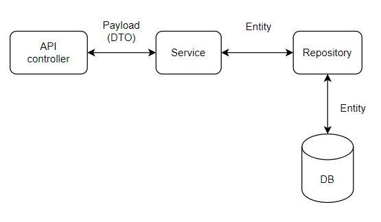

## TeamLog RESTful API Test Server

### Request example

------------

* Post 생성 

``` 
const createPost = (formData) => fetch('/api/posts', {
  method: 'Post',
  body: formData,
  headers: {}
});

const submitPost = () => {
  var data = { 
    contents: "asfasf",
    accessModifier: "PUBLIC",
    commentModifier: "PUBLIC",
    writerId: "string",
    hashtags: ["yaho", "스토리보드"],
    projectId: 9
  }
  const formData = new FormData();
  // file 보낼 것들...
  attachedFiles.forEach((file) => formData.append("files", file));
  // image? video? 그것도 위와 같은 방식으로..
  
  //json으로 보낼 것들
  formData.append(
    "key",
    new Blob([JSON.stringify(data)], { type: "application/json" })
  );

  let response = createPost(formData);
  ~~~ 이어서 구현
```

### Dependencies

------------

* Lombok
* Spring Web
* Spring Security
* Validation
* Spring Data JPA
* MySQL Driver

### Structure

------------

